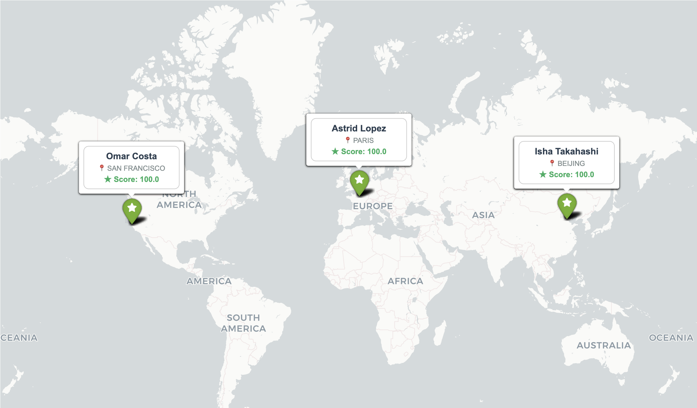

# 🌍 Elf Tracking System

Une mission de **Data Engineering** et de **Visualisation** pour préparer la tournée 2025. Ce projet extrait les données de la base elfique, corrige les coordonnées géographiques et génère une carte interactive pour localiser les 3 enfants les plus sages du monde.


> 🎅 **Challenge :** Ce projet est la solution du **Jour 8** du calendrier de l'avent [Coda School Advent 2025](https://coda-school.github.io/advent-2025/).
> *"Identifier les 3 enfants les plus sages et visualiser leur position précise sur une carte."*

## 📋 Description

Les données des enfants sont dispersées dans une base de données relationnelle (`kids.db`). De plus, les elfes utilisent leur propre système de coordonnées (métrique) différent du GPS standard.

Ce script réalise le pipeline suivant :
1.  **Extraction (ETL) :** Une requête SQL complexe avec des `JOINs` pour relier le score de sagesse (`behavior`), l'enfant, sa ville et ses coordonnées.
2.  **Transformation :** Conversion vectorisée des coordonnées du **Plan Elfique (EPSG:3857)** vers le standard **GPS (EPSG:4326)**.
3.  **Visualisation :** Génération d'une carte interactive avec cadrage automatique et étiquettes stylisées.

## 🚀 Démo

### 1. Extraction des Données
Voici le Top 3 identifié pour la tournée 2025 :

| First Name | City          | Latitude  | Longitude   |
|:-----------|:--------------|:----------|:------------|
| **Astrid** | Paris         | 48.875872 | 2.370207    |
| **Isha**   | Beijing       | 39.911644 | 116.391617  |
| **Omar**   | San Francisco | 37.790593 | -122.412131 |

### 2. Visualisation Cartographique
Une carte interactive est générée avec les 3 localisations :

**
> Les marqueurs verts indiquent la position précise. Une étiquette persistante affiche le nom, la ville et le score de sagesse.

## 🛠️ Installation & Utilisation

Ce projet est conçu pour être exécuté dans un **Jupyter Notebook** ou via un script Python standard.

### Prérequis
* Python 3.8+
* Les librairies de Data Science :

```bash
pip install pandas folium pyproj